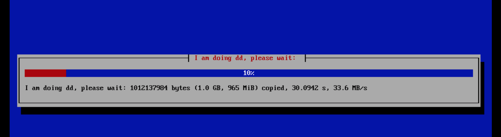

EN | [中文](readme.md)

build and deploy your cloud hypervisor/desktop/disk with onekeystoke diskdumping(demo pics attached)
=====

onekeydevdesk is a multi-os bundle which embeds a virtualboot+hypervisor in the live rom core, then a set of OSes/containers towards "local/remote mateable and transparently" theory and some uilities/scripts based around the core  
besides，onekeydevdesk is also a devstack with "limited app src unitfile size and limited language kernel explictly by contract,with language and runtime binded together as basic integrated unit " which alternatives to bash+SHELL  

> onekeydevdesk is also referred as：1keydd,1keydiskdump,1keydeepindsm,1keydebiandesk,1keydevdeploy,1keydebugdemo,1key desk dock,1key datacenter and desk,1key dir disk,etc ..

project repo url: https://github.com/minlearn/onekeydevdesk 

demo
-----

as the part of onekeydevdesk installation script, 1keydd inst.sh support dd progress bar inside debian installer（ demo video：https://www.bilibili.com/video/BV1ug411N7tn/ ）  
1keydd ci.sh can extends to multiple target models including [az](p/ddexpandcicustom/az/readme_en.md),[servarica](p/ddexpandcicustom/sr/readme_en.md),[oracle](p/ddexpandcicustom/orc/readme_en.md),[ksle](p/ddexpandcicustom/ks/readme_en.md),[spt](p/ddexpandcicustom/spt15g/readme_en.md) and customiablity, can be [self hosted](p/howtohost/readme_en.md) and packaged into a repo even a "ddhub",for each of your target host/target image combination,for later dd restoring  

as the part of onekeydevdesk os-bundle core,based on pve,onekeydevdesk implements a transparent ve: it supports single integrated gpu switch freely between host/subos within a host,and "local experience of file sharing and syncing mechanism just as if they are hypermanager pervioned vms" arcoss mateable internet vps os and local vps os entries
  
as one of onekeydevdesk's sub qemu vm OSes,the same windows image can be installed both on uefi/bios vps/bearmetal machines, without any difference and extra processing needed  

as one of onekeydevdesk's sub qemu vm OSes,dsm can be installed on vps, with no kvm-nested required upon host  

as one of onekeydevdesk's sub qemu vm OSes,osx uses standard full set kvm virtio drivers and bios model， should be installed on a 2c2g vps with kvm-nested (with 1c1.5g/2c2g give to osx, with 2c2g/3c3g give to osx the best),win11 is also supported,cloudosx+cloudwin11=local matedesk  

as part of onekeydevdesk uilities,1keydirdisk supports netdisk in dir-listing manner just inside file explorer

getting-started
-----

below are tested under vnc of an Debian and Debian flow Linux vps or local host,ubuntu <20.04,centos not recommended

> 安装onekeydevdesk,不喂任何参数默认等价于-s - -t onekeydevdesk  
> wget -qO- 1keydd.com/inst.sh | bash  

> 更多用法：  
> (安装其它目标os镜像：deb是纯净debian10,自定义镜像是你的raw系统硬盘格式经过gzip打包后托管的http/https地址)  
> wget -qO- 1keydd.com/inst.sh | bash -s - -t deb或自定gz镜像    
> (进入nc+dd模式：提供port:blkdevname参数形式将作为服务器接收端，提供blkdevname:ip:port参数形式将作为客户发送端)  
> wget -qO- 1keydd.com/inst.sh | bash -s - -t port:blkdevname或blkdevname:ip:port    
> (进入debug手动模式+自带vnc模式，无须-t)    
> wget -qO- 1keydd.com/inst.sh | bash -s - -d    

安装后，/run/initramfs/usr/bin/growpart /dev/vda(sda) 2,resize2fs /dev/vda(sda) 2扩展磁盘空间,root密码1keydd，https://xxx:8006为pve口，pve用户名root密码1keydd，vnc客户端连接你机器的ip:8059，密码为1keydd，二个lxc box的端口情况在各自的summary页有写，默认密码都是root/1keydd，如果是云主机建议开放8000-8100这些端口  

onekeydevdesk lxc os镜像在pve的storage->ct templates页可找到，github或github，不做说明的情况下，qemu版osx和dsm镜像并不提供开放托管和安装。  

docs
-----

更多请看项目文档库[《更多特点介绍和自助安装使用文档》](p/docs/readme_en.md)部分

服务
-----

免费
> 只提供inst.sh，可一站式解决你DD中大部分问题，去上面仓库，一键DD即可  
> 注：仅拥有inst.sh定制能力  

收费
> 项目1：解决特定机型DD中遇到的问题,定制dd脚本或镜像一次(60元-100元,usdt 10-15)  
> 项目2：获取osx或win11的系统镜像和安装服务一次（100元,usdt 15）  
> 项目3：加入付费dd群获取ci.sh脚本源码和1G资源享免费咨询技术支持1年（100元,usdt 15）  
> 注：拥有ci.sh扩展能力和自托管能力  
> 加作者个人TG：[minlearn_1keydd](https://t.me/minlearn_1keydd)简单说明需求或说明来意即可     

donate
> TRX/USDT/BTC/ETH: [TZ6YPtsojLCJEifNpwm38mmiq7T2gkhGKj](https://trx.tokenview.com/cn/address/TZ6YPtsojLCJEifNpwm38mmiq7T2gkhGKj)    
> (how to donate: 1,open the link above,2,use a client which support tron to scan the qrcode to donate)  

-----

此项目关联 https://github.com/minlearn/minlearnprogramming/tree/master/p/onekeydevdeskopen/ ，它是为配合我在《minlearnprogramming》最小编程/统一开发的想法的一个支持项目。  
本项目长期保存

